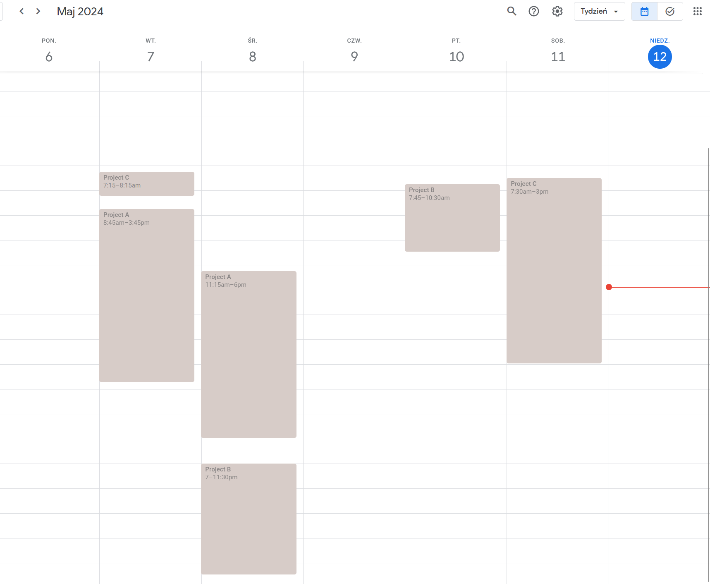
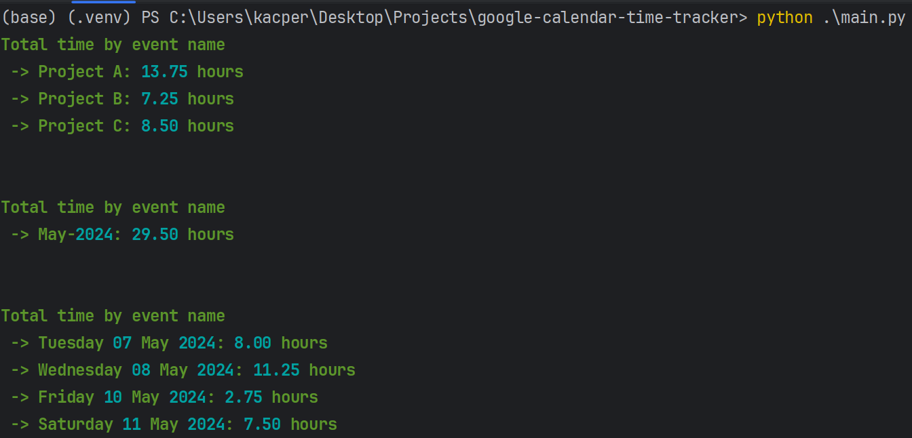

[![Contributors][contributors-shield]][contributors-url]
[![Forks][forks-shield]][forks-url]
[![Stargazers][stars-shield]][stars-url]
[![Issues][issues-shield]][issues-url]
[![MIT License][license-shield]][license-url]
[![LinkedIn][linkedin-shield]][linkedin-url]


<br />
<div align="center">
  <h3 align="center">Google Calendar Time Tracker</h3>

  <p align="center">
    Calculate total time for month, day and events - grouped by the same event name
    <br />
    <br />
    <a href="https://github.com/DEENUU1/google-calendar-time-tracker/issues">Report Bug</a>
    ·
    <a href="https://github.com/DEENUU1/google-calendar-time-tracker/issues">Request Feature</a>
  </p>
</div>




## Features
1. Fetch all events from specified Google Calendar 
2. Calculate total time for events grouped by event name 
3. Calculate total time for each day 
4. Calculate total time for each month

## Technologies:
- Python
- Google calendar

## Installation
Clone repository
```bash
git clone https://github.com/DEENUU1/google-calendar-time-tracker.git
```

Create virtual env (this may be different on Linux / MacOS)
```bash
python3 -m .venv .venv

.venv/Scripts/activate
```

Install requirements
```bash
pip install -r requirements.txt
```

Create .env file and set up Google account 
- You need to add `credentials.json` in this directory - see how to get it - https://www.youtube.com/watch?v=B2E82UPUnOY&t=1037s
- Then add CALENDAR_ID to the `.env` file - see how to get it - https://it.umn.edu/services-technologies/how-tos/google-calendar-find-your-google
```bash
cp .env_example .env
```

Run script and add optional parameters
```bash
python main.py 

python main.py --skip="Deadline, deadline, ..."
# For example if the Event starts with "Deadline" it's gonna be skipped 
# and not counted to the finall result

python main.py --year=2024 --month=5

python main.py --skip="Deadline, ..." --year=2024 --month=5
```


## Authors

- [@DEENUU1](https://www.github.com/DEENUU1)

<!-- LICENSE -->

## License

See `LICENSE.txt` for more information.


<!-- MARKDOWN LINKS & IMAGES -->
<!-- https://www.markdownguide.org/basic-syntax/#reference-style-links -->

[contributors-shield]: https://img.shields.io/github/contributors/DEENUU1/google-calendar-time-tracker.svg?style=for-the-badge

[contributors-url]: https://github.com/DEENUU1/google-calendar-time-tracker/graphs/contributors

[forks-shield]: https://img.shields.io/github/forks/DEENUU1/google-calendar-time-tracker.svg?style=for-the-badge

[forks-url]: https://github.com/DEENUU1/google-calendar-time-tracker/network/members

[stars-shield]: https://img.shields.io/github/stars/DEENUU1/google-calendar-time-tracker.svg?style=for-the-badge

[stars-url]: https://github.com/DEENUU1/google-calendar-time-tracker/stargazers

[issues-shield]: https://img.shields.io/github/issues/DEENUU1/google-calendar-time-tracker.svg?style=for-the-badge

[issues-url]: https://github.com/DEENUU1/google-calendar-time-tracker/issues

[license-shield]: https://img.shields.io/github/license/DEENUU1/google-calendar-time-tracker.svg?style=for-the-badge

[license-url]: https://github.com/DEENUU1/google-calendar-time-tracker/blob/master/LICENSE.txt

[linkedin-shield]: https://img.shields.io/badge/-LinkedIn-black.svg?style=for-the-badge&logo=linkedin&colorB=555

[linkedin-url]: https://linkedin.com/in/kacper-wlodarczyk

[basic]: https://github.com/DEENUU1/google-calendar-time-tracker/blob/main/assets/v1_2/basic.gif?raw=true

[full]: https://github.com/DEENUU1/google-calendar-time-tracker/blob/main/assets/v1_2/full.gif?raw=true

[search]: https://github.com/DEENUU1/google-calendar-time-tracker/blob/main/assets/v1_2/search.gif?raw=true
